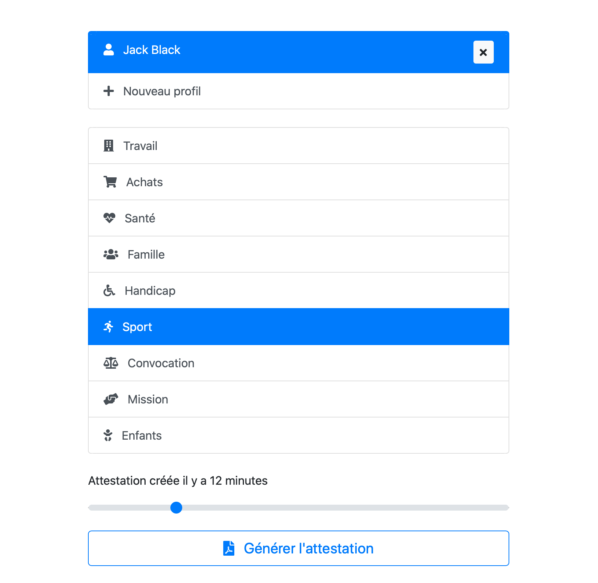

# Générateur d'attestations de déplacement dérogatoire

[Ouvrir l'application](https://funkyremi.github.io/covid-19/)

## Fonctionnalités

* Génération d'attestations en un clic
* Enregistrez et gardez en mémoire différents profils, éditez les plus tard
* Toutes les données restents enregistrées sur votre appareil et ne sont accessibles à personne
* Réglage de la date de création jusqu'à une heure plus tôt
* Signature numérique de l'attestation

## Demo

